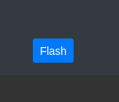
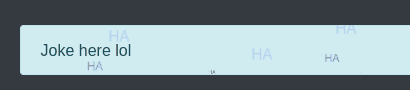

# StarSparkJs
Small and simple Javascript library for crating sparkling effects on elements

This is very early in development

## Usage
```js
new StarSpark(Element: target, object: options)
```

#### Example 1 
```js
let element = document.querySelector('#flash') // Pick element
new StarSpark(element, {
    'cycles':1, // Number of flashing cycles
    'sparksPerCycle':2, // Sparks per cycle
    'sparkDuration': 0.25, // Duration of spark in seconds
    'sparkSize': 1.5, // Size multiplier
    'sparkHTML':'✦', // innerHTML of spark
});
```


#### Example 2 - same but with onClick event

```js
let element = document.querySelector('#flash') // Pick element
element.addEventListener('click',function () {
    new StarSpark(this, {
        'cycles':1, // Number of flashing cycles
        'sparksPerCycle':2, // Sparks per cycle
        'sparkDuration': 0.25, // Duration of spark in seconds
        'sparkSize': 1.5, // Size multiplier
        'sparkHTML':'✦', // innerHTML of spark
    });
});
```
#### Example 3 - infinite sparkling


```js
new StarSpark(document.querySelector('#jokealert'), {
    'overflow': 0, // How many pixels to overflow from target in each direction
    'sparksPerCycle': 2,
    'sparkHTML': 'HA', 
    'sparkColor':"#0000ff", // Color of the sparks
    'infinite':true, // Makes the animation infinite
});
```


## Demo
[demo.html](https://delipistacna.github.io/StarSparkJs/demo.html)